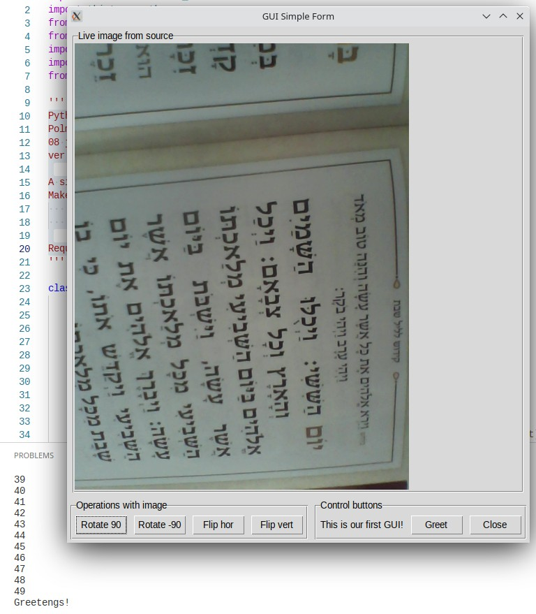

# GUI Video in async mode

## Table of Contents

- [About](#about)
- [Screenshots](#screenshots)

## About 

 Python >3.9
 Polma Izhak Eliyahu
 08 june 2022
 ver 0.1
 

### A simple program in one file - for readability

 Makes two asynchronous processes:
- prints to terminal
- shows two forms in tkinter with internal camera video
 
### Requires asyncio, opencv, Pillow, tkinter libraries to work
 

## Screenshots 

    
     Image 1 - view after run. Two Tkinter forms with some buttons. 
    In one of them live video from internal cam.
    In Terminial async printing of numbers from 1 to 50.
      
     
    
     Image 2 - After click on button Rotate90

