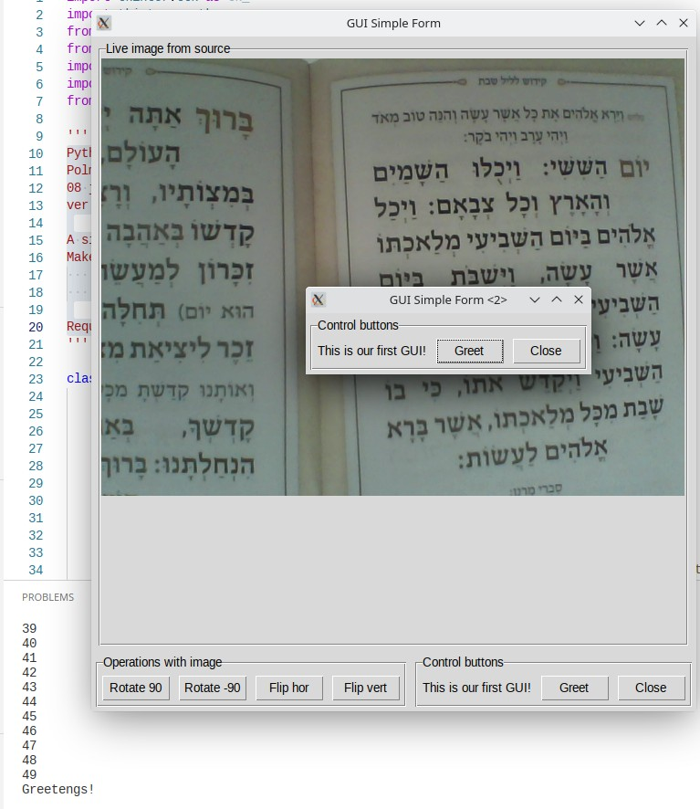

# GUI Video in async mode

## Table of Contents

- [About](#about)
- [Screenshots](#screenshots)

## About 

Python >3.9
Polma Izhak Eliyahu
08 june 2022
ver 0.1

A simple program in one file - for readability
Makes two asynchronous processes:
    - prints to terminal
    - shows two forms in tkinter with internal camera video

Requires asyncio, opencv, Pillow, tkinter libraries to work

## Screenshots 

    
    
Image 1 - view after run. Two Tkinter forms with some buttons. 
    In one of them live video from internal cam.
    In Terminial async printing of numbers from 1 to 50

    
    
Image 2 - After click on button Rotate90

